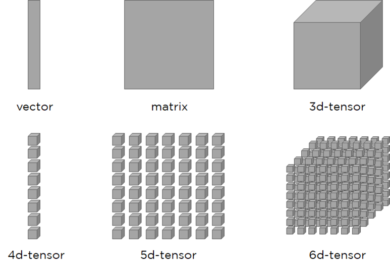

# 1. Hello Python
## a. Lessonlearned
 - 1차원 배열은 벡터(Vector), 2차원 배열은 행렬(Matrix), 벡터와 행렬을 일반화 한것을 텐서(Tensor)라고 한다.  좀 더는 Scalar -> Vector -> Matrix -> 3D Tensor -> 4D Tensor... 단계로 변화한다고 보면 된다.

 
 <h4>What is Tensor</h4>
 <a href="https://rekt77.tistory.com/102">https://rekt77.tistory.com/102</a>

- 위에 더해서,
> - Tensor를 배열의 집합이라고 이해하면 좋다.
> - Tensor 앞에 붙는 차원의 수는 Matrix의 Rank와도 같은 개념이다.
> - 배열의 차원에 따라 이름이 달라진다고 보면 된다.

- 파이썬 같은 동적언어는 C, C++ 같은 정적 언어(Compile 언어)에 비해 처리 속도가 느리다.  따라서 무거운 작업을 할 땐 C, C++로 작성한 프로그램을 쓰는 편이 좋다.
- 파이썬을 실행하는 방식에는 '인터프리터'와 '스크립트 파일' 두 가지가 있다.

## b. Programming
### b.1 pure Python
#### b.1.1 Concept
- Python Data type(자료형)은 정수(Integer), 실수(Floating point), 문자열(String) 등이 있다.
- 알파벳이나 단어를 Variable(변수)로써 값을 저장해놓을 수 있다.
- Python은 dynamic programming language으로, 변수의 자료형이 상황에 따라 설정 가능하다.
- List 자료형은 Slicing을 통해 특정 부분만 불러들일 수 있다.
- Dictionary는 인덱스로 값을 저장하는 List와 다르게 Key:value 쌍으로 저장된다. (not-ordered)
- Boolean 자료형은 True or False를 저장하고 and, or, not 연산자를 사용할 수 있다.
- 이외에도 if, elif, else / while / for를 통해서 반복 혹은 조건문을 사용할 수 있다.
- 그 외에는 Function 기능을 통해 함수를 선언할 수 있다.
- Class 자료형이 있다.  
- Class 자료형은 초기에 __init__ 이라는 메서드를 이용하여 초기화 시킬 수 있다.  해당 메서드는 생성자(constructor)라고 하며 클래스의 인스턴스가 생성될 적에 한번 호출된다.

#### b.1.2 Command
- 커맨드 창에서 "python --version"으로 현재 파이썬 버전을 확인할 수 있다.

### b.2 Numpy
#### b.2.1 Concept

- Numpy 에서는, array 간의 기본적인 사칙연산은 Element-wise 하게 진행 된다.  각 원소 별로 혹은 각 구성성분 별로 사칙연산을 한다.
- Numpy 에서는, 원소 별 곱셈을 Element-wise product 라고 한다.

- Numpy 에서는, 넘파이 배열 간이 아닌 스칼라값과의 조합으로도 연산을 할 수 있다.
  이 때 스칼라를 배열의 각각에 연산을 진행하게 된다.  이를 Broadcast라고 한다.
  이는 어떠한 Boolean 같은 조건에도 해당하기 떄문에 익숙해지도록 훈련해야 한다.
  
- Numpy 에서는, 배열 간 곱셈을 하면, element-wise하게 계산된다. (not dot-product)

- Numpy 에서는, Broadcasting을 통해 서로 크기가 다른 배열 혹은 배열과 스칼라 값 간의 연산이 가능하다.
  이 개념은 후에 딥러닝의 풀링, Pandas이 DataFrame 간에도 사용된다.

#### b.2.2 Command
- Numpy 에서는, np.array([ ]) 를 통해 배열(ndarray을 만들 수 있다.
- Numpy 에서는, dtype으로 데이터형을, shape으로 사이즈를 확인할 수 있다.
- Numpy 에서는, Nested array의 indexing은 array[i][j]식으로 할 수 있다. (더 많아진다면 더 많아짐)
  세로를 Row라고 한다.  긴 세로를 뜻한다.  먼저 오는 인덱싱이 행, 뒤의 인덱싱이 열이다.

# Futher study
1. ~~What is tensor?~~
2. Array와 Matrix, dataframe 그리고 기존의 행열에서 행과 열, indexing을 명확히 할 것
   세로를 Row라고 한다.  긴 세로를 뜻한다.
3. ~~Scipy lecture note?~~
4. 파이썬 라이브러리를 활용한 데이터분석(한빛 미디어)
5. 처음 시작하는 파이썬(한빛 미디어)

# Self-made question
1. Sin, Cos 0에서 10까지 그리기, 레전드 및 각 라벨을 그리고 타이틀을 설정하기
   cos는 점선으로 표현하기
